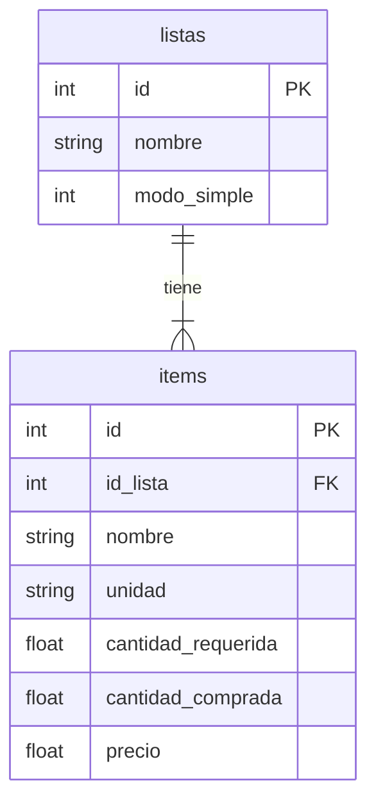

# Introducción

Esta es una app para llevar el control de listas de compras de productos

# Features

## En Producción

- Se pueden tener varias listas de compras, para distintos negocios o tipos de negocios.
- Se puede registrar el nombre del producto que se necesita, en qué cantidad se necesita, qué cantidad se compró, y el precio.
- Se muestra el total de la compra con los productos que ya se han agregado al carrito.
- Se pueden ver las listas en modo detallado, donde se puede incluir cantidades compradas y precios; o en modo simple, donde sólo se marca si el item se compró o no.
- Evitar que se creen listas vacías.
- Evitar que se creen productos sin nombre.
- Los productos que faltan por comprar se ordenan al principio de la lista y en orden alfabético.
- Le interfaz está en inglés y español.

## Backlog
- Las listas "recuerdan" elementos agregados anteriormente, y lo dan como sugerencia cuando el usuario escribe para agregar un elemento nuevo.
- La etiqueta de las unidades del producto cambian si deben ir en singular o plural.
- Ícono de la app.
- Modales para confirmar acciones de borrado
- Comportamiento de la tecla "back" del teléfono
- Botón para marcar un item como "no hay, queda para la siguiente visita a la tienda"
- ¿Modal para agregar y editar items en vez de hacerlo en la misma lista?
- Evitar que el ícono del link al home se mueva cuando entras a la vista de una lista.
## Bugs

# ERD

